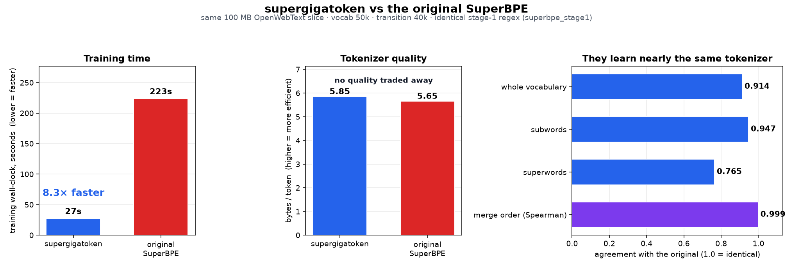
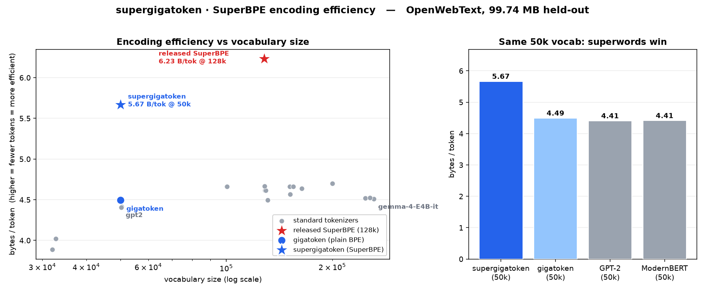
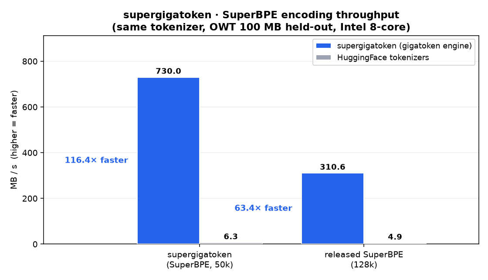

# Supergigatoken

<div align="center">

**Fast Rust trainers for BPE *and* SuperBPE — and a fast encoder for both.**

*Train a 50k tokenizer in seconds, a 50k SuperBPE in minutes, then encode at hundreds of MB/s: **8× faster training** and **116× faster encoding** than HuggingFace `tokenizers`, on a SuperBPE that packs ~20% more text into every token.*



Same corpus slice, same vocabulary size, same transition point, same stage-1 regex — so the only thing that differs is the implementation.
[How the comparison was run →](benchmarks/superbpe/REPORT.md)

</div>

## What is Supergigatoken?

**SuperBPE** ([Liu et al., 2025](https://arxiv.org/abs/2503.13423)) trains BPE in two stages: **stage 1** is ordinary whitespace-pretokenized BPE (subwords), and **stage 2** resumes training with the whitespace restriction lifted, learning *superwords* that bridge multiple words (e.g. `of the`, `in the United States`). Because one token can now cover several words, SuperBPE encodes the same text in meaningfully fewer tokens at the same vocabulary size.

Supergigatoken trains and encodes both kinds of tokenizer natively, in Rust:

- **`train_bpe(...)`** — the ordinary BPE trainer, inherited from gigatoken and benchmarked here against HuggingFace for the first time: **3.8× faster than `BpeTrainer`** at a matched 50k vocab on the same corpus (2.8 s vs 10.4 s on 100 MB), and 500 MB trains in 7 s.
- **`train_superbpe(...)`** — the two-stage trainer. **8.0× faster than the original SuperBPE implementation** at matched settings, and it does not run out of memory where that one does.
- **one encoder for both** — gigatoken's GB/s subword path, plus a `Superword` two-level mode (added here) that recovers most of a cached tokenizer's speed once whitespace pretokenization has been lifted. It covers the tokenizer released with the paper as well as ones trained here. HuggingFace encodes SuperBPE slowly; tiktoken cannot represent it at all.
- **an evaluation suite** under [`benchmarks/superbpe/`](benchmarks/superbpe/) — encoding efficiency, encoding throughput, trainer speed vs HuggingFace, and a trainer + vocabulary comparison against the original SuperBPE.

Every number below is reproducible from that suite; each section names the script that emits it.

It is a fork of [**gigatoken**](https://github.com/marcelroed/gigatoken), which is where the underlying speed comes from — SIMD pretokenization, a tuned pretoken cache, GB/s subword encoding, and HuggingFace/tiktoken compatibility. Supergigatoken is a strict superset: it keeps the `gigatoken` import name and CLI, so existing gigatoken code keeps working unchanged. The inherited subword throughput matrix (23 tokenizer families × 3 CPUs) is reproduced in [`benchmarks/compare/SUBWORD_THROUGHPUT.md`](benchmarks/compare/SUBWORD_THROUGHPUT.md) rather than here. What the **fork** adds is the SuperBPE half: `train_superbpe`, the `Superword` encoder and loader, the `superbpe_stage1` and `superword_bounded` schemes, and the evaluation suite. `train_bpe` and the subword encoder come from gigatoken and are labelled as such wherever they appear below.

## Encoding



### Encoding efficiency (bytes/token)

Trained on 500 MB of OpenWebText at a matched **50k vocab** (40k transition → ~8k superwords), measured on a disjoint **100 MB** held-out slice. Higher bytes/token = fewer tokens for the same text = more efficient.

| Tokenizer | Vocab | Bytes/token | Tokens (100 MB) | |
|---|---:|---:|---:|---|
| Released SuperBPE | 128k | **6.23** | 16.0M | reference (Liu et al.) |
| **supergigatoken** (SuperBPE) | **50k** | **5.67** | **17.6M** | `train_superbpe` |
| gpt-oss / Phi-4-mini | 200k | 4.70 | 21.2M | standard BPE |
| Llama 3.1 | 128k | 4.67 | 21.4M | standard BPE |
| Gemma 4 | 262k | 4.51 | 22.1M | standard BPE |
| **gigatoken** (plain BPE) | **50k** | **4.49** | **22.2M** | `train_bpe`, same corpus/vocab, no superwords |
| GPT-2 | 50k | 4.41 | 22.6M | standard BPE |

At a matched 50k vocab, supergigatoken encodes the held-out slice in **20.7% fewer tokens** than gigatoken's plain BPE (5.67 vs 4.49 bytes/token). That is the controlled comparison — same corpus, same vocab size, same engine, only the whitespace restriction differs.
Remarkably, a **50k** SuperBPE beats *every* standard tokenizer measured, including ones with 4–5× larger vocabularies (Gemma 4 at 262k, Qwen 3.5 at 248k).

### Encoding throughput (vs HuggingFace)

Both engines load the *same* `tokenizer.json` and are handed the *same* pre-split documents, so the only difference is which one does the work. HF gets its fastest path (`encode_batch_fast`) and full parallelism; tiktoken cannot represent SuperBPE at all. Same 100 MB held-out slice (19937 docs), Intel 8-core CPU, min of 9 repeats:



| Tokenizer | supergigatoken | HF tokenizers | speedup |
|---|---:|---:|---:|
| SuperBPE, 50k (trained here) | **730.0 MB/s** | 6.3 MB/s | **116×** |
| released SuperBPE, 128k | **310.6 MB/s** | 4.9 MB/s | **63×** |
| plain BPE, 50k | **2297.1 MB/s** | 4.0 MB/s | **577×** |

The 128k row is the checkpoint released with the paper, which this fork could not load at all until recently — it ships an explicit `Split` regex rather than the whitespace-lifted export, so it takes a different outer scheme (`superword_bounded`) into the same two levels. It is not an apples-to-apples third row: different vocabulary, different corpus, and outer pretokens that its own regex has already bounded.

SuperBPE is the harder case for both engines, and the reason is the same one that makes it fast to *use*: the exported tokenizer declares no pretokenization at all (`ByteLevel(use_regex=False)`), so each document arrives as one long pretoken. That is worth ~3.1× against our own plain-BPE path — and it costs HuggingFace an order of magnitude more, because it has no equivalent of the two-level trick below.

**Read that table as ratios, not as four significant digits.** "Min of 9" takes the best of nine repeats *inside* one process; it does nothing about variance *between* processes, and on this box that is **±16% on the supergigatoken column against ±4% on the HuggingFace one** — five runs of the SuperBPE row at identical settings gave 618, 730, 745, 745 and 829 MB/s, against 6.3, 6.5 and 6.8 for HuggingFace. The asymmetry is the interesting part, and it is not a defect in the slower engine: supergigatoken finishes the 100 MB slice in 137 ms where HuggingFace needs 15.9 s, so its measurement is ~116× shorter and OS scheduling across 8 rayon workers becomes the dominant error term. The engine is fast enough that the harness is a good part of what is being measured.

A sixth run came in at 511 MB/s and is excluded: three unrelated Python processes were started on the box while it ran. That is the same effect from the other side — the contaminated draw moved the 137 ms row by −31% and the 25 s plain-BPE row by −0.9% — and it is the practical reason to distrust any single draw here, including a fast one. The figures above are one run with the machine otherwise idle, landing within 0.5% of the five-run mean.

#### How two-level encoding works

Lifting whitespace pretokenization makes each document **one long pretoken**, which costs SuperBPE every mechanism a fast tokenizer relies on: the pretoken cache never hits (documents are unique), the SIMD boundary scanners have nothing to find, and the merge heap runs over thousands of byte symbols.

Most of it is recoverable. Merge priority is the token ID and stage-2 merges are appended after stage-1's, so the merge table splits at a **threshold** into stage-1 merges that cannot span a stage-1 pretoken boundary and superword merges that can. Encoding therefore runs in two levels:

1. **Level 1** splits at stage-1 boundaries and encodes each unit through the ordinary cached path with the sub-threshold merges — the fast path, with cache reuse, a seeded vocab and the SIMD scan intact.
2. **Level 2** runs the full table over the resulting token stream, ~4.5× shorter than the byte sequence. It only merges across boundaries a merge can actually cross, which the merge table alone determines: on this corpus that cuts 51% of them and leaves independent runs averaging 2 symbols, so the heap all but disappears.

Output is bit-identical to feeding the whole document to the byte-level merge loop — asserted token-for-token over the whole slice, not just on hand-picked cases.

There is more to recover: this is still ~3.1× off the plain subword path (2297 MB/s at the same vocab), and the remaining cost is **33% level 1 / 67% level 2** — the merge, not the splitting, is now what is left to attack.

The same two levels run on the checkpoint released with the paper, whose exported pretokenizer keeps some outer boundaries instead of lifting them all. Level 2 then runs once per outer pretoken rather than once per document, which needs no new soundness argument but does shorten the runs it merges over. Single-threaded, on 33.5 MB of OpenWebText with the token streams asserted identical over all 6819 documents, that is **85.8 MB/s against 31.6 MB/s** for feeding each outer pretoken to the byte-level merge loop — 2.72×, at a derived threshold of 85956.

That threshold is a *safety bound*, not the release's own stage-1/stage-2 boundary: the first merge it built to span whitespace is `" of"`+`" the"` at 100164, but a sound bound has to hold for every merge below it, including ones nobody designed. Merge 85956 is `b"\x8a"` + `b"\n"` — the tail byte of some multi-byte character joined to a newline, which is a real pretoken boundary for any character in that class that happens to be a letter. Choosing the smaller number costs almost nothing (it moves a handful of rare merges from level 1 to level 2, which carries the full table anyway) and is what makes the output bit-identical rather than nearly so. Verified against HuggingFace over the whole 99.7 MB slice: 16,007,082 tokens each, zero documents differing.

## Trainers

Two trainers, both in Rust, both reproducible from the suite. The BPE trainer is measured against the one nearly everyone uses; the SuperBPE trainer against the only other implementation that exists.

### `train_bpe`: 3.8× faster than HuggingFace

gigatoken's trainer, not the fork's — but nothing had ever measured it against the trainer nearly everyone actually uses, so here it is. Same 100 MB corpus, same 50k target vocab — and both land on exactly 50000 tokens, so this is equal work, not a shortcut. Both are byte-level with the GPT-2 split regex, HuggingFace is seeded with the full 256-byte `initial_alphabet` (otherwise it only learns the bytes its corpus happens to contain), and `min_frequency=0` on both so neither prunes a search the other has to finish. Timing wraps the train call only. Min of 3.

| Trainer | Train time | Throughput |
|---|---:|---:|
| **`gt.train_bpe`** | **2.8 s** | **36.0 MB/s** |
| HF `tokenizers` `BpeTrainer` | 10.4 s | 9.6 MB/s |

Cost is dominated by the merge loop over *unique* words rather than by corpus size, and unique words grow sublinearly — which is why 5× the corpus is nowhere near 5× the time: the full **500 MB** run trains a 50k vocab in **7.0 s**. Reproduce with `trainer_vs_hf.py`.

tiktoken is absent from this table because it ships no trainer at all.

### `train_superbpe`: 8.0× faster than the original SuperBPE

Both trainers run on the same 100 MB slice at 50k vocab / 40k transition, using the reference's own stage-1 regex on both sides — a trainer comparison that differs in pretokenization is not controlled.

| Trainer | Train time | Stage 1 | Stage 2 | Superwords | Bytes/token |
|---|---:|---:|---:|---:|---:|
| **supergigatoken** (`train_superbpe`) | **28.1 s** | **2.0 s** | **26.1 s** | 8118 | **5.85** |
| original SuperBPE | 223.4 s | 10.3 s | 213.1 s | 8894 | 5.65 |

Faster *and* marginally more efficient. Stage 2 dominates both sides — 26.1 s of our 28.1 s, 213.1 s of the reference's 223.4 s — because lifting the whitespace restriction is what explodes a trainer's unit set.

The two learn nearly the same tokenizer: **47742 of 50000 tokens shared** (Jaccard 0.914) and, over the 47226 merges both learned, merge-order **Spearman 0.999**. That last number is the one that matters, because BPE output depends on merge *priority*, not just on which tokens exist — shared tokens sit 38 IDs apart at the median, so they are the same decision rather than a coincidence.

Divergence concentrates where stage 2 has freedom (superwords, Jaccard 0.765), and part of it is structural rather than stochastic: supergigatoken's stage-2 units are line-bounded, so it learns **zero** superwords containing a newline against the reference's 48.

Full write-up, including why the comparison runs at 100 MB (the reference reached 21 GB resident at 500 MB and was still climbing): [benchmarks/superbpe/REPORT.md](benchmarks/superbpe/REPORT.md).

### Train your own

```python
import gigatoken as gt

corpus = open("owt_train.txt", "rb").read()
vocab, merges = gt.train_superbpe(
    corpus,
    vocab_size=50_000,
    transition_point=40_000,   # stage 1 stops here; the remaining merges are superwords
    special_tokens=[],
)
```

The 50k SuperBPE above trained in ~13 min on 500 MB. Pass `pretokenizer="superbpe_stage1"` to use the original SuperBPE stage-1 regex instead of the GPT-2 default — it keeps combining marks inside their letter run, which matters for any script that writes vowels as marks (under the GPT-2 regex, Devanagari `हिन्दी` fragments into six pretokens and no consonant+matra unit can ever be learned).

The [`benchmarks/superbpe/`](benchmarks/superbpe/) suite exports the result to a HuggingFace `tokenizer.json` (whitespace-lifted `ByteLevel(use_regex=False)`, so superwords fire at encode time) and reproduces every number above:

```bash
uv run benchmarks/superbpe/train_baselines.py --file ~/data/owt_train.txt
uv run benchmarks/superbpe/efficiency.py --released
uv run benchmarks/superbpe/throughput.py --released --repeats 9
uv run benchmarks/superbpe/trainer_vs_hf.py --engine ours   # train_bpe vs HF BpeTrainer,
uv run benchmarks/superbpe/trainer_vs_hf.py --engine hf     # one engine per process
uv run benchmarks/superbpe/vocab_diff.py --ours ... --reference ...   # vs the original
uv run benchmarks/superbpe/report.py     # tables + plots -> benchmarks/superbpe/REPORT.md
```

## Installation
Build from source with [`uv`](https://docs.astral.sh/uv/) and a Rust nightly toolchain (pinned by `rust-toolchain.toml`):
```bash
git clone <this-repo> && cd supergigatoken
uv run python -c "import gigatoken; print('ok')"   # builds the Rust extension on first run
```

The upstream tokenizer — without the SuperBPE additions — is on PyPI as `pip install gigatoken`.

## Usage
The Python module is imported as `gigatoken`. It can be used with its own (native) API, or in compatibility mode with HuggingFace Tokenizers or tiktoken.

### Compatibility Mode (Easiest)
```python
import gigatoken as gt

# Minimum change from existing HuggingFace tokenizers usage (compatibility mode)
hf_tokenizer = ...
tokenizer = gt.Tokenizer(hf_tokenizer).as_hf()

# tokenizer can be used in the same contexts as hf_tokenizer
tokens = tokenizer.encode_batch(["This is a test string", "And here is another"])

# OR with tiktoken
tiktokenizer = ...
tokenizer = gt.Tokenizer(tiktokenizer).as_tiktoken()

# Now works like existing tiktoken tokenizers
tokens = tokenizer.encode_batch(["This is a test string", "And here is another"])
```

A substantial amount of effort has been put into making sure the outputs match exactly with what you would get with HuggingFace Tokenizers in this setting, but this is at a non-negligible cost to performance.
You can still expect way faster performance across the board, but not quite the 1000x you will get with the native API.

### Native API (Fastest)
```python
import gigatoken as gt

tokenizer = gt.Tokenizer("Qwen/Qwen3-8B")  # Accepts HF model names
file_source = gt.TextFileSource(["owt_train.txt"], separator=b"<|endoftext|>")
tokens = tokenizer.encode_files(file_source)
```

Using the native API lets the Rust implementation read data directly, and skips as much overhead as possible while allowing for maximum parallelism.
Keep in mind that passing Python data structures through this API still incurs the overhead of reading from Python.

## Subword tokenizers

Supergigatoken inherits gigatoken's encoding engine unchanged, so ordinary
subword tokenizers run at the same GB/s: **24.5 GB/s** for GPT-2 on a 144-core
EPYC, **8.8 GB/s** on an M4 Max, roughly 1000× HuggingFace and 700× tiktoken
(both of which are themselves multithreaded Rust).

The full matrix — 23 tokenizer families across 3 CPUs, with methodology and the
list of which models map to which family — is generated into
[`benchmarks/compare/SUBWORD_THROUGHPUT.md`](benchmarks/compare/SUBWORD_THROUGHPUT.md).
Credit for those numbers belongs upstream; they are here only to say that
adding SuperBPE cost the subword path nothing.


## FAQ

### Q: Is a SuperBPE tokenizer a drop-in replacement?
For encoding, yes — export it as a HuggingFace `tokenizer.json` and `gigatoken.Tokenizer` loads it, or hand it to HuggingFace directly (just slower). What SuperBPE changes is the *token stream*, so a model has to be trained or adapted for the new vocabulary; it is not a swap-in for an existing checkpoint's tokenizer.

### Q: Why is SuperBPE encoding slower than subword encoding, when it produces fewer tokens?
Fewer tokens, more work per byte. A subword tokenizer's speed comes from caching per word: the same word recurs constantly, so it is looked up rather than merged. Lifting whitespace pretokenization removes that unit — the "word" becomes the whole document, which never recurs. [Two-level encoding](#how-two-level-encoding-works) rebuilds most of the cache reuse; closing the rest is ongoing work.

### Q: Which stage-1 regex should I train with?
`"superbpe_stage1"` if you care about scripts that write vowels as combining marks, since the GPT-2 default excludes `\p{M}` and fragments them (measured: −44.75% bytes/token for Hindi at a 4k vocab). The default stays `"gpt2"` so previously published numbers keep reproducing.

### Q: I've found a mismatch or a slow case — is that expected?
Probably not. For anything SuperBPE-specific (`train_superbpe`, the `Superword` encoder, the eval suite), open an issue here. For the underlying subword engine, upstream [gigatoken](https://github.com/marcelroed/gigatoken/issues) is the right place.

## Citation
Supergigatoken builds on gigatoken (the fast encoder) and SuperBPE (the two-stage training method). If you use it in your research, please cite both:

```bibtex
@software{roed2026gigatoken,
  author = {Marcel R{\o}d},
  title = {{G}igatoken: SIMD and Cache Hierarchies for 1000x Faster Byte-Pair Encoding Tokenization on Modern CPUs},
  url = {https://github.com/marcelroed/gigatoken},
  year = {2026},
}

@inproceedings{liu-etal-2025-superbpe,
  title     = {{SuperBPE}: Space Travel for Language Models},
  author    = {Alisa Liu and Jonathan Hayase and Valentin Hofmann and Sewoong Oh and Noah A. Smith and Yejin Choi},
  booktitle = {Second Conference on Language Modeling},
  year      = {2025},
  url       = {https://arxiv.org/abs/2503.13423},
}
```

## Known Issues

* SuperBPE encoding lifts whitespace pretokenization, so each document is one long pretoken. Two-level encoding recovers most of the cached path (116× faster than HuggingFace) but is still ~3.1× below the plain subword path. Level 1 now runs on the SIMD two-phase fill, which moved the balance to **33% level 1 / 67% level 2**: the level-2 merge is where the remaining cost sits, and it is the next lever.
* The throughput figures carry ~±16% between-process variance on the supergigatoken column, against ~±4% on the HuggingFace one, because a 137 ms measurement across 8 rayon workers is far more exposed to OS scheduling than a 16 s one — and a busy box costs the fast row 30× more than the slow one. Treat the ratios as the result and the digits as one draw; `--repeats` only reduces variance *within* a process.
* The released 128k's own outer regex has no SIMD scanner — `superword_bounded` is a scalar walker, because its boundaries are not a subset of stage 1's and so cannot be filtered out of the existing mask harvest. Measured at 578.6 MB/s it is 15% of that checkpoint's two-level cost, capping a vectorized replacement at 1.18×, so it is deferred rather than done.
* The level-1 splitter glues the pretokenizer boundaries a sub-threshold merge could otherwise span. Whitespace runs, apostrophes, digit runs and non-ASCII-on-both-sides are glued always; word-initial right sides (`" Mc"|"C"`, `" ’"|"s"`) and whitespace after a combining mark are glued only for a tokenizer whose threshold that actually lifts, because they coarsen units and cost ~10% throughput (147.9 vs 163.9 MB/s) on one that doesn't. A hazard neither set covers stays safe but slow — it lowers the derived threshold, which moves work from level 1 to level 2.
* Byte-level BPE merges *fragments* of characters, so a merge's operands need not be whole characters — and a junction that decodes to nothing on the right is a real boundary whose next character is merely unknown, not an interior one. Deriving the threshold as if it were interior mis-encoded Arabic letter + comma on both the released 128k and the 50k artifact committed here (5 tokens in 16,007,082). Fixed by enumerating a truncated character's completions and gluing non-ASCII pairs outright; the remaining conservatism is one arm, where the *left* operand opens mid-character and no valid probe can be built, capping the release's threshold at 85956 against a semantic transition of 100164.
* Stage-2 training is O(n) in unit length; training large vocabs on hundreds of MB is minutes-scale. Stage 2 uses line-bounded units, so a superword can never span a newline — the reason supergigatoken's output is *outcome*-comparable to the original SuperBPE rather than byte-identical in its merges.

**WordPiece (BERT family) is supported**, and is the one place this fork adds a model rather than a scheme: `bert-base-uncased`, `bert-base-cased` and `bert-base-multilingual-cased` load and encode bit-identically to HuggingFace `tokenizers` at `add_special_tokens=False`, at 618 MB/s against HF's 13.9 on 100 MB of OWT. It rides the existing byte-level engine — MaxMatch is a third arm of the pretoken-miss path, so the pretoken cache, worker pool and PyO3 surface are inherited unchanged. Encoding is *not* invertible (the pretokenizer drops whitespace, the normalizer folds case and accents), so decoding goes through HF's `WordPiece` decoder; `[CLS]`/`[SEP]` wrapping comes from `as_hf()`, matching `transformers` for whichever source you hand it. Unigram (T5, XLM-R, ALBERT, mT5) is still unsupported, and there is no WordPiece trainer.

Inherited from gigatoken and unchanged here: SentencePiece models are far less optimized than BPE ones, file sinks are missing from the native API, Python iteration pays ABI3 overhead, and Windows is lightly tested (prefer WSL for perf work — though the SuperBPE suite, including the reference-trainer comparison, does run natively on it).

---

<details>
<summary>AI Use Disclosure</summary>

The **SuperBPE extension** in this fork — the `train_superbpe` trainer, the `Superword` encoder and loader, and the `benchmarks/superbpe/` evaluation suite — was implemented with AI assistance.

The underlying **gigatoken** code base was largely written by hand (visible in its Git history), with AI assistance in its later stages for the user-facing API, compatibility breadth, porting SIMD strategies across AVX-512/AVX2/NEON, and final profiling work. See [upstream](https://github.com/marcelroed/gigatoken) for its own disclosure.
</details>
