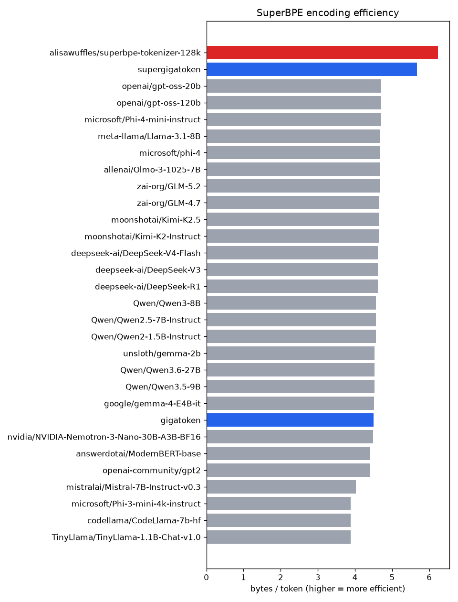
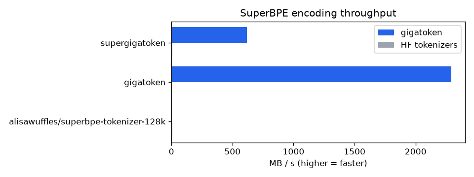

# SuperBPE evaluation (supergigatoken)

SuperBPE (Liu et al., 2025) trained natively by supergigatoken's `train_superbpe`, evaluated against the original released SuperBPE and gigatoken's benchmark tokenizer set along three axes: **encoding efficiency**, **encoding throughput**, and **trainer output/speed** vs the original reference.

## Axis 1 — Encoding efficiency (bytes/token)

_CPU: Intel64 Family 6 Model 189 Stepping 1, GenuineIntel (8 cores) · eval slice: 99.74 MB · 19937 docs · vocab=50000, transition=40000_

Higher bytes/token = fewer tokens for the same text = more efficient. The controlled result is **supergigatoken's SuperBPE vs gigatoken's plain BPE at identical vocab** (only the whitespace restriction differs); other rows are reference points at their own vocab sizes.

| Tokenizer | Group | Vocab | Bytes/token | Tokens |
|---|---|---:|---:|---:|
| `supergigatoken` | ours (matched vocab) | 50000 | **5.6659** | 17603858 |
| `gigatoken` | ours (matched vocab) | 50000 | **4.4939** | 22194723 |
| `alisawuffles/superbpe-tokenizer-128k` | released SuperBPE | 128001 | **6.231** | 16007082 |
| `microsoft/Phi-4-mini-instruct` | gigatoken benchmark set | 200029 | **4.7016** | 21214061 |
| `openai/gpt-oss-120b` | gigatoken benchmark set | 200019 | **4.7016** | 21214061 |
| `openai/gpt-oss-20b` | gigatoken benchmark set | 200019 | **4.7016** | 21214061 |
| `meta-llama/Llama-3.1-8B` | gigatoken benchmark set | 128256 | **4.6674** | 21369859 |
| `allenai/Olmo-3-1025-7B` | gigatoken benchmark set | 100278 | **4.6631** | 21389238 |
| `microsoft/phi-4` | gigatoken benchmark set | 100352 | **4.6631** | 21389238 |
| `zai-org/GLM-5.2` | gigatoken benchmark set | 154856 | **4.6611** | 21398399 |
| `zai-org/GLM-4.7` | gigatoken benchmark set | 151365 | **4.6608** | 21399969 |
| `moonshotai/Kimi-K2-Instruct` | gigatoken benchmark set | 163840 | **4.6386** | 21502489 |
| `moonshotai/Kimi-K2.5` | gigatoken benchmark set | 163840 | **4.6386** | 21502489 |
| `deepseek-ai/DeepSeek-R1` | gigatoken benchmark set | 128815 | **4.6136** | 21618688 |
| `deepseek-ai/DeepSeek-V3` | gigatoken benchmark set | 128815 | **4.6136** | 21618688 |
| `deepseek-ai/DeepSeek-V4-Flash` | gigatoken benchmark set | 129280 | **4.6136** | 21618688 |
| `Qwen/Qwen2-1.5B-Instruct` | gigatoken benchmark set | 151646 | **4.5683** | 21833133 |
| `Qwen/Qwen2.5-7B-Instruct` | gigatoken benchmark set | 151665 | **4.5683** | 21833133 |
| `Qwen/Qwen3-8B` | gigatoken benchmark set | 151669 | **4.5683** | 21833133 |
| `unsloth/gemma-2b` | gigatoken benchmark set | 256000 | **4.5235** | 22049655 |
| `Qwen/Qwen3.5-9B` | gigatoken benchmark set | 248070 | **4.5196** | 22068714 |
| `Qwen/Qwen3.6-27B` | gigatoken benchmark set | 248070 | **4.5196** | 22068714 |
| `google/gemma-4-E4B-it` | gigatoken benchmark set | 262144 | **4.5089** | 22120654 |
| `nvidia/NVIDIA-Nemotron-3-Nano-30B-A3B-BF16` | gigatoken benchmark set | 131072 | **4.4937** | 22195549 |
| `answerdotai/ModernBERT-base` | gigatoken benchmark set | 50368 | **4.4137** | 22598137 |
| `openai-community/gpt2` | gigatoken benchmark set | 50257 | **4.4072** | 22631261 |
| `mistralai/Mistral-7B-Instruct-v0.3` | gigatoken benchmark set | 32768 | **4.0222** | 24797324 |
| `TinyLlama/TinyLlama-1.1B-Chat-v1.0` | gigatoken benchmark set | 32000 | **3.8881** | 25652822 |
| `codellama/CodeLlama-7b-hf` | gigatoken benchmark set | 32016 | **3.8881** | 25652821 |
| `microsoft/Phi-3-mini-4k-instruct` | gigatoken benchmark set | 32011 | **3.8881** | 25652822 |

At matched vocab, supergigatoken reaches **1.26x** the bytes/token of gigatoken's plain BPE — **20.7% fewer tokens** for the same text.

## Axis 2 — Encoding throughput (gigatoken vs HF)

_CPU: Intel64 Family 6 Model 189 Stepping 1, GenuineIntel (8 cores) · eval slice: 99.74 MB · 19937 docs · vocab=50000, transition=40000 · min of 9 repeats_

gigatoken fast-encodes a SuperBPE tokenizer via the `Superword` pretokenizer (whitespace lifted). tiktoken is skipped — it cannot represent SuperBPE.

| Tokenizer | gigatoken MB/s | HF MB/s | speedup | gigatoken Mtok/s | HF Mtok/s |
|---|---:|---:|---:|---:|---:|
| `alisawuffles/superbpe-tokenizer-128k` | **-** | 6.1 | -x | - | 0.978 |
| `gigatoken` | **2290.85** | 4.12 | 556.03x | 509.77 | 0.917 |
| `supergigatoken` | **618.19** | 6.76 | 91.45x | 109.109 | 1.192 |

## Axis 3 — Trainer parity vs the original SuperBPE

_CPU: Intel64 Family 6 Model 189 Stepping 1, GenuineIntel (8 cores) · eval slice: 99.74 MB · train slice: 100.0 MB · vocab=50000, transition=40000 · stage-1 scheme: `superbpe_stage1`_

Outcome parity (training speed + tokenizer quality), **not** byte-identical merges — see `reference/README.md`.

| Trainer | Train s | Stage1 s | Stage2 s | Vocab | Superwords | Superword % | Bytes/token |
|---|---:|---:|---:|---:|---:|---:|---:|
| supergigatoken train_superbpe | 28.069 | 1.977 | 26.078 | 50000 | 8118 | 16.24 | 5.8498 |
| reference SuperBPE | 223.44 | 10.334 | 213.106 | 50000 | 8894 | 17.79 | 5.6538 |

supergigatoken's `train_superbpe` trains in **7.96x** the reference's wall-clock (higher = faster).

Example learned superwords: `Media playback is unsupported on your device Media caption`, `Advertisement Continue reading the main story`, `Story continues below advertisement`, `Read or Share this story: http://`, `Enlarge this image toggle caption`, ` Continue reading the main story`, `Media playback is unsupported`, ` on your device Media caption`.

## Axis 3b — Vocabulary differential vs the original SuperBPE

Axis 3 compares outcomes; this compares the vocabularies themselves. Membership overlap alone would not settle it — BPE output depends on merge *priority*, so the rank agreement and displacement columns matter as much as the Jaccard ones.

| | ours | reference |
|---|---:|---:|
| Vocab size | 50000 | 50000 |
| Superwords | 8118 | 8894 |
| Mean token bytes | 6.9 | 7.06 |
| Mean superword bytes | 9.65 | 9.99 |
| Longest superword | 58 | 36 |
| Mean words / superword | 2.24 | 2.24 |

| Overlap | Shared | Jaccard | % of ours | % of reference |
|---|---:|---:|---:|---:|
| Whole vocab | 47742 | 0.9136 | 95.48 | 95.48 |
| Subwords | 40370 | 0.9473 | 96.39 | - |
| Superwords | 7372 | 0.7647 | 90.81 | 82.89 |
| Merges | 47226 | 0.9027 | - | - |

Merge-order agreement over the 47226 merges both sides learned: Spearman **0.999**. Shared tokens sit 38 ids apart at the median (82.67% within 100, p90 492), so a shared token is usually the *same decision*, not a coincidence.

- **Learned by both, earliest:** ` of the`, ` in the`, `, and`, `, the`, ` to the`, `. The`
- **Ours only, earliest:** `, 201`, ` in 201`, `: “`, ` edit ]`, ` [ edit ]`, `,” he`
- **Reference only, earliest:** ` [ edit`, ` [ edit ]\n`, ` July `, ` March `, ` May `, ` June `

---

_Regenerate: `efficiency.py`, `throughput.py`, `parity.py`, `vocab_diff.py`, then `report.py`. The reference side of Axes 3/3b comes from `reference/run_reference.py` (isolated env)._
